# 📊 Análisis Integral de Servicios Culturales, Sociales, Deportivos y Recreativos del ISSSTE (2013–2024)

# Limpieza, Transformación y Visualización de Datos para la Evaluación del Desempeño por Delegación

Este proyecto desarrolla un análisis completo del dataset de servicios culturales, sociales, deportivos y recreativos ofrecidos por el ISSSTE a nivel nacional. El proceso incluye la limpieza y estandarización de la información, la creación de métricas clave, el análisis exploratorio mediante tablas dinámicas y el diseño de un dashboard interactivo en Excel.

---

## 📚 Tabla de Contenidos

- [🎯 Propósito](#-propósito)
- [📦 Conjunto de Datos](#-conjunto-de-datos)
- [🧪 Desarrollo del Proyecto](#-desarrollo-del-proyecto)
- [📌 Vista previa del dashboard](#-vista-previa-del-dashboard)
- [💡 Insights claves](#-insights-claves)
- [🛠️ Tecnologías](#️-tecnologías)
- [⚙️ Instalación](#️-instalación)
- [👤 Autor](#-autor)

---

## 🎯 Propósito

El propósito de este proyecto es evaluar la prestación de servicios del ISSSTE:
* Limpieza y preparación de datos (Excel).
* Construcción de tablas dinámicas para análisis descriptivo y comparativo.
* Desarrollo de dashboards ejecutivos con KPIs y visualizaciones.
* Identificación de patrones, tendencias y variaciones interanuales.

---

## 📦 Conjunto de Datos

El conjunto de datos utilizado contiene las siguientes columnas:

- ``anio``: Año en el que se registró la información.
- ``oficina_representacion``: Nombre de la oficina o entidad estatal que reporta los datos.
- ``serv_culturales_derechohab_publ``: Número de servicios culturales otorgados a derechohabientes del sector público.
- ``serv_deportivos_derechohab_publ``: Número de servicios deportivos otorgados a derechohabientes del sector público.
- ``serv_sociales_derechohab_publ``: Número de servicios sociales otorgados a derechohabientes del sector público. (En tus datos aparece vacío, pero la columna representa esto.)
- ``serv_funerarios_derechohab_publ``: Número de servicios funerarios otorgados a derechohabientes del sector público.
- ``serv_sociales_pensionados_jubl``: Número de servicios sociales otorgados a pensionados y jubilados.
- ``fome_deportivo_pensionados_jubl``: Número de servicios deportivos otorgados a pensionados y jubilados.
- ``serv_culturales_pensionados_jubl``: Número de servicios culturales otorgados a pensionados y jubilados.
- ``soci_comedores_pensionados_jubl``: Número de servicios de comedores sociales otorgados a pensionados y jubilados.
- ``fecha``: Fecha exacta en la que se registraron o consolidaron los datos.

Fuente: [Instituto de Seguridad y Servicios Sociales de los Trabajadores del Estado (ISSSTE)](https://datos.gob.mx/dataset/servicios_culturales_sociales_deportivos_recreativos).

---

## 🧪 Desarrollo del Proyecto

### **Limpieza y preprocesamiento**
**1. Estructuración inicial del dataset**

   * Convertí la fuente original a un formato tabular para facilitar su análisis.
   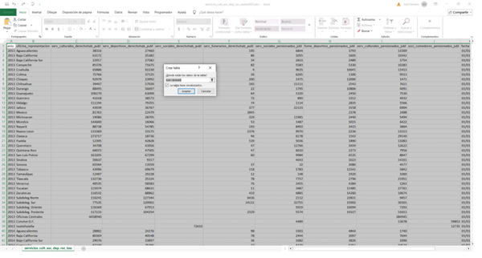
   * Apliqué el tipo de dato adecuado a cada columna (numérico, texto, fecha, categórico), garantizando la integridad durante las operaciones posteriores.
   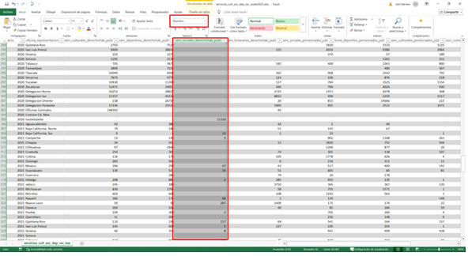

**2. Correcciones básicas de calidad**

   * Realicé una revisión de ortografía en los encabezados para estandarizar nombres y evitar inconsistencias.
   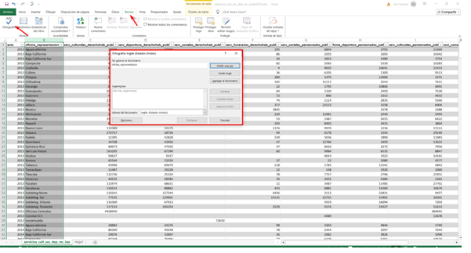
   * Eliminé caracteres no visibles (saltos ocultos, símbolos invisibles, ASCII residuales).
   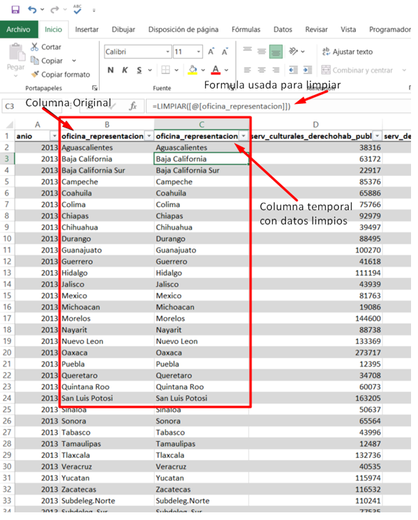
   * Depuré espacios en blanco adicionales (al inicio, final y duplicados dentro del texto).
   
   * Eliminé registros duplicados para evitar sesgos en el análisis.
   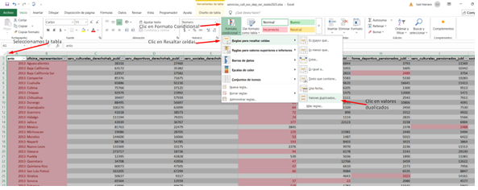
   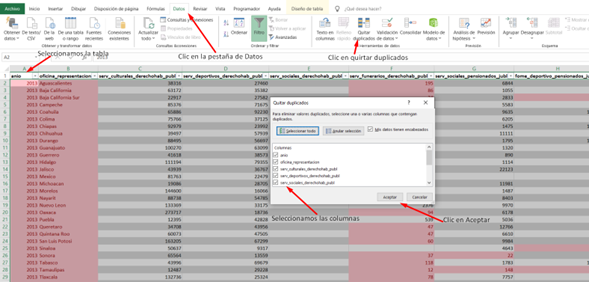
   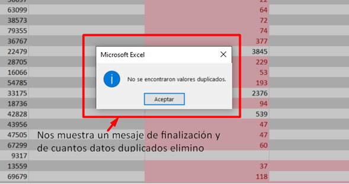

**3. Tratamiento de valores faltantes**

   * Imputé las celdas vacías asignando el valor 0, ya que no existía información disponible para obtener los datos originales(si es que los hay) y la eliminación de registros no era una alternativa viable. Esta imputación permitió conservar la integridad del dataset sin comprometer la estructura ni perder observaciones relevantes.
   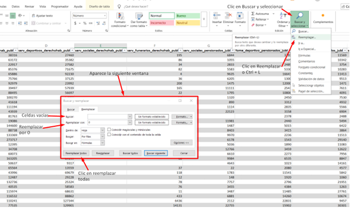
   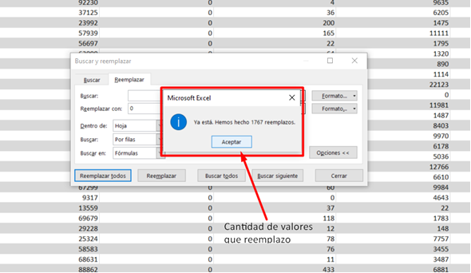

**4. Estandarización de columnas**

   * Renombré todas las columnas con nombres claros, consistentes y fáciles de interpretar, facilitando la lectura y el uso del dataset en herramientas de análisis.
   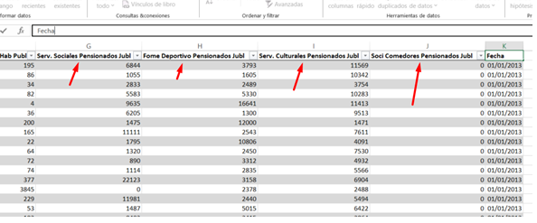

**Limpieza Posterior / Ajustes Adicionales**

Durante la creación de tablas dinámicas(desarrollo del EDA) se detectaron inconsistencias en los nombres de los estados (errores ortográficos, abreviaturas, ausencia de acentos, variaciones no estándar). Para asegurar la coherencia de las categorías:
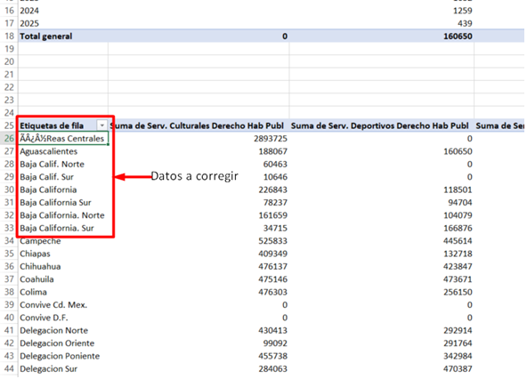

**1. Normalización de nombres de estados**

   * Utilicé Buscar y Reemplazar para corregir variaciones comunes.
   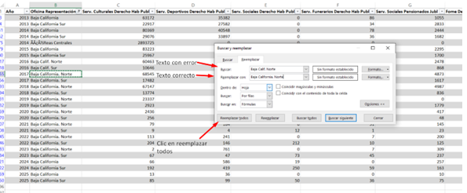
   * Apliqué revisión de ortografía para corregir errores directos.
   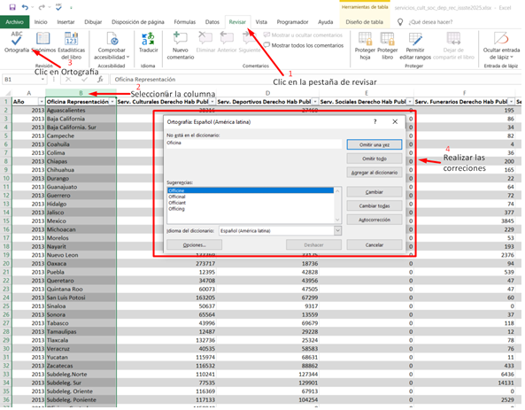
   * Ajusté manualmente los casos individuales donde la automatización no fue suficiente.
   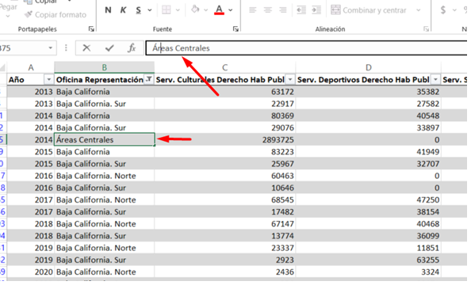

Este proceso garantizó que todas las categorías territoriales fueran consistentes, estandarizadas y aptas para análisis comparativos.

### **Análisis exploratorio de datos (EDA)**

Durante el análisis exploratorio se construyeron tablas dinámicas y visualizaciones con el fin de identificar patrones, comparar categorías y evaluar el comportamiento de los servicios registrados por estado y por oficina de representación.

Además de su valor analítico, estas tablas fueron diseñadas con un formato tipo reporte, facilitando su interpretación tanto por equipos técnicos (para identificar áreas de mejora, calidad de datos o flujos operativos) como por equipos ejecutivos (que requieren información clara y accionable para la toma de decisiones).

**Preparación previa**

* Columna de suma total por estado: Se creó una columna adicional para calcular la suma total de servicios por estado/oficina, permitiendo construir rankings comparativos y evaluar el volumen total atendido.
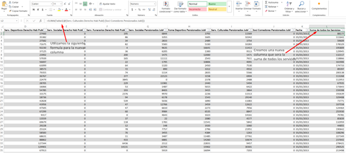

**Construcción de Tablas Dinámicas**

* Procedimiento:

   * Se seleccionó el rango de datos previamente limpio y estructurado.
   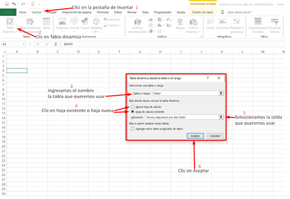
   * Se configuraron los campos de cada tabla dinámica según la pregunta a resolver.
   * Se estandarizaron los encabezados para asegurar claridad, consistencia y facilidad de lectura.
   

Como resultado se obtuvieron tres tablas dinámicas principales:

* Servicios deportivos por año
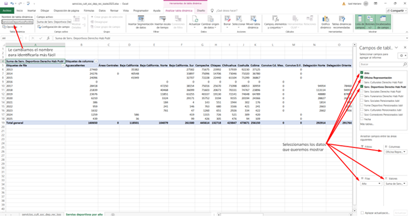
* Comparación entre servicios culturales, deportivos y sociales
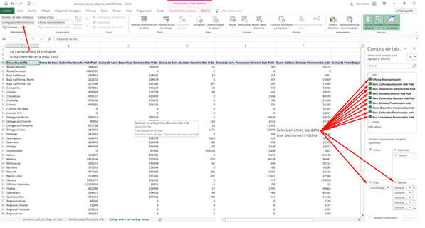
* Ranking de oficinas de representación
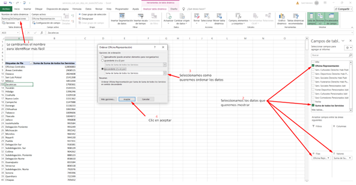

El diseño final de cada tabla se ajustó con formato de reporte, facilitando su presentación a usuarios técnicos y directivos.

**Visualizaciones y Formato Final**

* Se generaron gráficos para cada tabla dinámica, reforzando la interpretación visual.
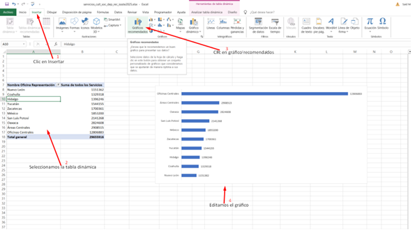
* Las hojas se editaron para ofrecer una presentación más profesional (títulos, alineación, etiquetas y disposición del contenido).  

* Se añadió un insight clave en cada apartado, resumiendo el hallazgo más relevante de forma directa.
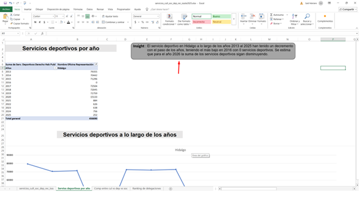

4. **Visualización de datos**:
   - Uso de gráficos de barras, líneas, cajas, dispersión y mapas de calor.

5. **Modelado o reportes (opcional)**:
   - [Si aplica: modelos de ML, clustering, predicciones, etc.]

6. **Conclusiones y recomendaciones**:
   - Síntesis de hallazgos clave y propuestas de acción.

---

## 📌 Vista previa del dashboard
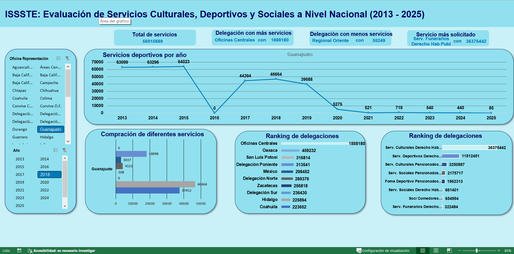

---

## 💡 Insights claves

- [Insight 1]
- [Insight 2]
- [Recomendación práctica o estratégica basada en los datos]

---

## 🛠️ Tecnologías

- Excel

---

## ⚙️ Instalación

### 1. Clonar este repositorio:
```bash
git clone https://github.com/tu_usuario/nombre_del_proyecto.git
```

---

## 👤 Autor

**Said Mariano Sánchez** – *smariano170@gmail.com*  
Este proyecto forma parte de mi portafolio como analista de datos Jr.

---

## 📝 Licencia

Este proyecto está licenciado bajo la **Licencia MIT**. Puedes usarlo, modificarlo y distribuirlo libremente, siempre que menciones al autor original.

---